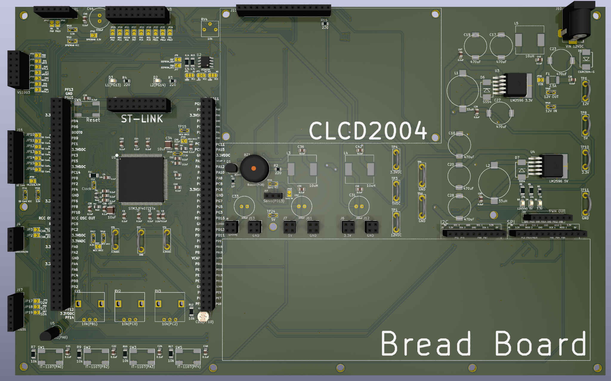
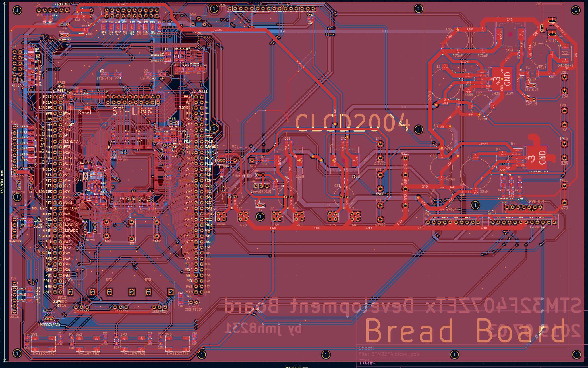

# STM32F407ZETx 개발보드

**STM32F407ZETx** MCU를 중심으로 DS3231(RTC), VS1003(Audio Codec), microSD(4‑bit SDIO),
SN65HVD230(CAN), USB‑to‑TTL, **DP83848(Ethernet PHY)** 등을 온보드로 구성하고
대형 **브레드보드**와 12 V/5 V/3.3 V 전원 및 **SPI/I²C/PWM 헤더**를 둘러 배치한 실습·프로토타이핑 전용 보드입니다.



---

## 1. 보드 하이라이트

- **MCU**: STM32F407ZETx (LQFP‑144), 8/16 MHz 외부 크리스털, ST‑LINK 20‑핀
- **전원 트리**: 12 V DC 잭 입력 → **LM2596‑5 V**, **LM2596‑3.3 V**
  - 브레드보드 주변에 **12 V / 5 V / 3.3 V 전원 핀** 다수 제공
- **통신/네트워킹**
  - **DP83848** 10/100 Ethernet PHY + RJ45
  - **SN65HVD230** CAN 트랜시버
  - **USB‑to‑TTL**(FT232RL 계열)
- **저장/오디오/시간**
  - **microSD(4‑bit SDIO)**, **VS1003** 오디오 코덱, **DS3231 RTC**
- **사용자 입출력**
  - **20×4 캐릭터 LCD(CLCD2004)** 장착 영역(백라이트 제어)
  - **브레드보드** 장착(보드 일체), 주변에 **SPI/I²C/PWM 헤더** 배치
  - 가변저항/버튼/버저 등 실습용 풋프린트
- **확장성**: 각 인터페이스에 테스트 포인트/점퍼 제공



---

## 2. 주변장치 매핑 요약

| 기능 | 부품/모듈 | 인터페이스 | 비고 |
|---|---|---|---|
| Ethernet | TI **DP83848** | RMII/MII | RJ45, 링크 LED |
| CAN | TI **SN65HVD230** | CAN | 종단저항 점퍼 |
| Audio | **VS1003** | SPI / I²S | Sine test 지원 |
| Storage | microSD | **4‑bit SDIO** | 카드 감지/쓰기보호 |
| RTC | **DS3231** | I²C | 코인셀 백업 |
| USB‑UART | **FT232RL** | USB‑CDC | 부트 로그/쉘 |
| LCD | **CLCD2004** | 병렬 | 백라이트 제어 |
| Breadboard | 1열×2면 | — | SPI/I²C/PWM/전원 배치 |

---

## 3. 빠른 시작

1) 12 V 어댑터 연결 → 전원 LED 확인  
2) ST‑LINK 연결 후 예제 펌웨어 다운로드  
3) **Ethernet → CAN → SDIO → I²C(DS3231) → SPI(VS1003)** 순으로 브링업  
4) 브레드보드에 센서/액추에이터 연결 → SPI/I²C/PWM 헤더로 배선  
5) LCD 장착 후 상태/메뉴 표시 구현

---

## 4. 브링업 체크리스트

- **전원 리플/부하 테스트**(5 V/3.3 V)
- **SDIO 4‑bit**: HS 모드, 카드 감지/쓰기 보호 입력 확인
- **RMII/MII**: DP83848 링크/속도/MDIO 확인
- **CAN**: 루프백 → 실선 통신, 종단저항 설정
- **RTC**: DS3231 1 Hz/32 kHz, 온도 보정 레지스터 확인
- **VS1003**: SCI 레지스터 접근, sine test

---

## 5. 파일 트리

```text
stm32f407-devboard/
├─ README.md
└─ docs/
   └─ images/
      ├─ render_top.png
      ├─ pcb_layout.png
      └─ photo_top.jpg
```
